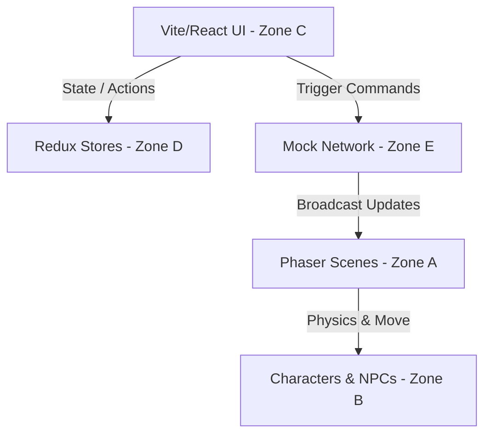

# 📍 GPS Code Map: Ponytail AI Office (Vibe)

นี่คือ "แผนที่นำทาง GPS" ของโปรเจค Ponytail AI Office (Voice) เพื่อให้ AI และนักพัฒนาคนต่อไป ค้นหาและระบุตำแหน่งไฟล์ที่จะต้องแก้ไขได้ทันทีโดยไม่ต้องอ่านโค้ดทั้งโปรเจค!

---

## 🗺️ ภาพรวมโซนโค้ด (Code Zones)

---

## 📁 รายละเอียดแต่ละโซน (Zone Breakdown)

### 🚀 Zone A: Game Engine & Scenes (แกนเกม)
รับผิดชอบการตั้งค่า Phaser และการโหลดแผนที่/Assets
*   **[PhaserGame.ts](file:///d:/antigravity/voice/voice-office/src/PhaserGame.ts):** ไฟล์กำหนด Config ของ Phaser 3 (ขนาด, ฟิสิกส์, แรงโน้มถ่วง, รายการ Scene)
    *   *เมื่อไหร่ต้องแก้:* เมื่อต้องการเปลี่ยนขนาดเกม, เปิด/ปิด Debug mode ของฟิสิกส์
*   **[scenes/Bootstrap.ts](file:///d:/antigravity/voice/voice-office/src/scenes/Bootstrap.ts):** โหลด Assets ทั้งหมด (ตัวละคร, ไอเทม, แผ่นเสียง, แผนที่) และสั่งเริ่มเกม
    *   *เมื่อไหร่ต้องแก้:* เมื่อต้องการเพิ่มตัวละครใหม่ หรือเพิ่ม Assets รูปภาพ/เสียงใหม่เข้ามาในระบบ
*   **[scenes/Background.ts](file:///d:/antigravity/voice/voice-office/src/scenes/Background.ts):** ฉากหลัง ท้องฟ้า และระบบเวลา (กลางวัน/กลางคืน)
*   **[scenes/Game.ts](file:///d:/antigravity/voice/voice-office/src/scenes/Game.ts):** ฉากออฟฟิศหลัก โหลดไอเทมจาก Tiled JSON, ตรวจสอบการชน (Collision), จัดการการทับซ้อน (Overlap) ของตัวละครกับวัตถุ
    *   *เมื่อไหร่ต้องแก้:* เมื่อต้องการเพิ่มจุดตรวจจับการชนใหม่ หรือควบคุมการตอบสนองเมื่อผู้เล่นเดินชนเก้าอี้/โต๊ะ

---

### 🚶 Zone B: Characters & NPCs (ตัวละคร & พฤติกรรม)
สไปรต์ตัวละคร แอนิเมชัน และการควบคุมตัวละคร
*   **[characters/Player.ts](file:///d:/antigravity/voice/voice-office/src/characters/Player.ts):** คลาสแม่ของตัวละครทั้งหมด จัดการแอนิเมชันพื้นฐานและตำแหน่งชื่อผู้เล่น
*   **[characters/MyPlayer.ts](file:///d:/antigravity/voice/voice-office/src/characters/MyPlayer.ts):** คลาสควบคุมผู้เล่นหลัก (คีย์บอร์ด, การเดินชน, การกดนั่งเก้าอี้)
*   **[characters/OtherPlayer.ts](file:///d:/antigravity/voice/voice-office/src/characters/OtherPlayer.ts):** คลาสสำหรับผู้เล่นคนอื่น (และ NPCs) ขับเคลื่อนด้วยการเคลื่อนที่แบบ Linear Interpolation เพื่อให้ภาพสมูท
*   **[anims/CharacterAnims.ts](file:///d:/antigravity/voice/voice-office/src/anims/CharacterAnims.ts):** แอนิเมชันเฟรมการเดิน, นั่ง, ยืน ของตัวละครแต่ละตัว (Nancy, Lucy, Ash, Adam)

---

### 💻 Zone C: React UI Components (หน้าจอผู้ใช้)
หน้าจอล็อบบี้, เมนูด้านข้าง, ช่องแชท และปุ่มลัดต่างๆ
*   **[App.tsx](file:///d:/antigravity/voice/voice-office/src/App.tsx):** โครงสร้าง Layout หลัก ตัดสินใจว่าจะเปิดหน้าจอเลือกห้อง หน้าล็อคอิน หรือหน้าจอเกมหลัก
*   **[components/Chat.tsx](file:///d:/antigravity/voice/voice-office/src/components/Chat.tsx):** ช่องแชทหลัก ดับจับข้อความที่พิมพ์เพื่อส่งเข้า Command System ของ Network
*   **[components/LoginDialog.tsx](file:///d:/antigravity/voice/voice-office/src/components/LoginDialog.tsx):** หน้าต่างเลือกตัวละครหลักและกรอกชื่อก่อนเข้าเกม
*   **[components/RoomSelectionDialog.tsx](file:///d:/antigravity/voice/voice-office/src/components/RoomSelectionDialog.tsx):** เมนูเริ่มต้นในการเลือกห้อง
*   **[components/HelperButtonGroup.tsx](file:///d:/antigravity/voice/voice-office/src/components/HelperButtonGroup.tsx):** ปุ่มควบคุมเสริม เช่น เปลี่ยนสกินเกม (กลางวัน/กลางคืน), ลิงก์สังคมออนไลน์

---

### 📊 Zone D: State Management (ระบบจัดเก็บสถานะ Redux)
จัดเก็บและแชร์ข้อมูลข้ามระหว่าง React UI และ Phaser Game
*   **[stores/index.ts](file:///d:/antigravity/voice/voice-office/src/stores/index.ts):** จุดรวม Redux Store ทั้งหมด
*   **[stores/ChatStore.ts](file:///d:/antigravity/voice/voice-office/src/stores/ChatStore.ts):** เก็บข้อความประวัติแชท
*   **[stores/UserStore.ts](file:///d:/antigravity/voice/voice-office/src/stores/UserStore.ts):** เก็บข้อมูลผู้ใช้หลักที่เข้าสู่ระบบ อวตาร์ และโหมดกลางวัน/กลางคืน
*   **[stores/RoomStore.ts](file:///d:/antigravity/voice/voice-office/src/stores/RoomStore.ts):** เก็บสถานะห้องที่มีให้เลือก

---

### ❄️ Zone E: Offline & Simulation Layer (ระบบจำลองออฟไลน์)
หัวใจสำคัญของการทำงานแบบ Standalone (ไม่ต้องพึ่ง Server)
*   **[services/Network.ts](file:///d:/antigravity/voice/voice-office/src/services/Network.ts):** ตัวหลักที่ทำการตัด Colyseus และ WebRTC ออก แล้วเปลี่ยนเป็นระบบจำลอง NPC (Lucy และ Ash)
    *   *คำอธิบายเพิ่มเติม:* มี AI Command Interpreter ดักจับคำแชท เช่น `lucy go to vending` หรือ `ash go to whiteboard` แล้วทำการสั่งงาน Phaser Game ให้ย้ายพิกัดและสั่งแอนิเมชันให้พนักงานเดินไปพิกัดนั้นจริงๆ
*   **[web/WebRTC.ts](file:///d:/antigravity/voice/voice-office/src/web/WebRTC.ts) / [web/ShareScreenManager.ts](file:///d:/antigravity/voice/voice-office/src/web/ShareScreenManager.ts):** ไฟล์ Stub ป้องกันการเรียกใช้กล้อง/ไมค์ และสกรีนแชร์ของระบบ PeerJS เพื่อป้องกันเบราว์เซอร์ฟ้อง Error

---

## 🛠️ วิธีการขยายระบบ / เพิ่มพนักงานใหม่

1.  **เพิ่มสกินพนักงานใหม่:** โหลดสไปรต์ชีตใหม่ใน `src/scenes/Bootstrap.ts` และลงทะเบียนแอนิเมชันใน `src/anims/CharacterAnims.ts`
2.  **เพิ่มตัวละครจำลอง (NPC):** เพิ่มตัวแปรพิกัดของตัวละครใน `Network.ts -> npcPositions` และสั่งให้ spawn ในเมธอด `spawnNPCs()`
3.  **เขียน AI Logic ควบคุมพนักงานเพิ่ม:** เพิ่มเงื่อนไขคำสั่งใน `Network.ts -> handleChatCommands(content)` เพื่อตรวจสอบข้อความใหม่และคำสั่งย้ายตัวละคร
